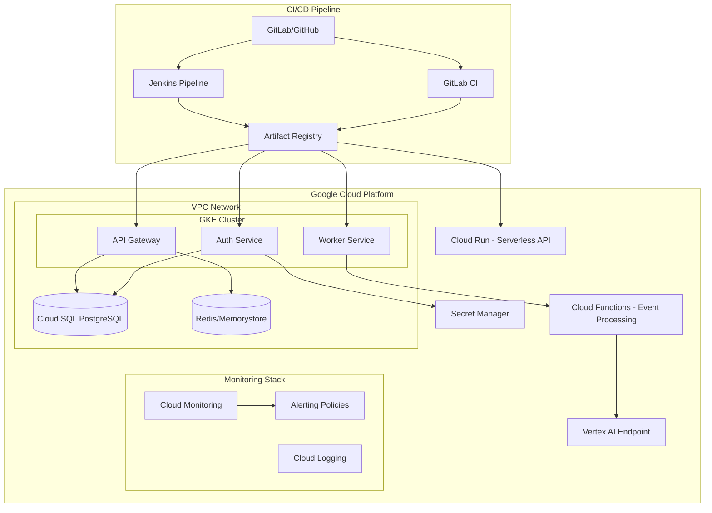
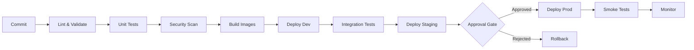

# NexusDeploy

[](https://www.terraform.io/)
[](https://cloud.google.com/)
[](https://kubernetes.io/)
[](https://www.docker.com/)
[](https://www.jenkins.io/)
[](https://docs.gitlab.com/ee/ci/)
[](https://www.python.org/)
[](https://www.ansible.com/)

> A production-grade DevOps reference architecture demonstrating enterprise-level infrastructure automation on Google Cloud Platform.

---

## Overview

NexusDeploy is a comprehensive, battle-tested DevOps reference architecture that covers the full infrastructure lifecycle on Google Cloud Platform. It combines infrastructure-as-code, multi-pipeline CI/CD, containerized workloads on GKE, serverless compute, observability, security hardening, cost governance, and AI/ML infrastructure into a single cohesive system that reflects real-world enterprise requirements.

The platform is built around the principles of **high availability**, **blast-radius containment**, and **progressive delivery**. Every component is deployed across multiple zones, guarded by network policies, and promoted through environments via approval-gated pipelines. Rollbacks are automated at the pipeline layer; canary deployments at the traffic layer. SLO error budgets drive alerting thresholds rather than arbitrary metric ceilings — a broken window is only an incident if it threatens the customer experience.

NexusDeploy is opinionated where opinions accelerate delivery — Terraform modules enforce naming conventions, RBAC is generated from workload-identity bindings, secrets never leave Secret Manager — and flexible where organizations differ, offering both Jenkins and GitLab CI as first-class citizens with identical capability coverage. Whether you are adopting this as a greenfield blueprint or retrofitting existing infrastructure, the modular design allows components to be adopted incrementally.

---

## Architecture Diagram



---

## CI/CD Pipeline Flow



---

## Project Structure

```
nexusdeploy/
├── terraform/                        # Infrastructure as Code
│   ├── environments/                 # Per-environment root modules
│   │   ├── dev/                      # Development environment
│   │   ├── staging/                  # Staging environment
│   │   └── prod/                     # Production environment
│   └── modules/                      # Reusable Terraform modules
│       ├── vpc/                      # VPC, subnets, NAT, firewall rules
│       ├── gke/                      # GKE cluster + node pools
│       ├── cloud-sql/                # Cloud SQL (PostgreSQL) with HA
│       ├── cloud-run/                # Cloud Run services
│       ├── cloud-functions/          # Cloud Functions (event-driven)
│       ├── iam/                      # IAM roles + workload identity bindings
│       ├── monitoring/               # Dashboards, alerts, SLO policies
│       ├── secret-manager/           # Secret Manager + rotation policies
│       └── vertex-ai/                # Vertex AI endpoints + pipelines
├── kubernetes/                       # Kubernetes manifests
│   ├── base/                         # Kustomize base resources
│   ├── overlays/                     # Per-environment overlays
│   │   ├── dev/
│   │   ├── staging/
│   │   └── prod/
│   └── helm/                         # Helm charts
│       └── nexusdeploy/              # Main application chart
├── ci/                               # CI/CD pipeline definitions
│   ├── jenkins/                      # Jenkinsfiles and shared libraries
│   └── gitlab/                       # .gitlab-ci.yml and stage templates
├── docker/                           # Container definitions
│   ├── api-gateway/                  # API Gateway service
│   ├── auth-service/                 # Authentication service
│   └── worker-service/               # Background worker service
├── ansible/                          # Configuration management
│   ├── playbooks/                    # Ansible playbooks
│   └── roles/                        # Reusable Ansible roles
│       ├── common/                   # Base OS hardening
│       ├── docker/                   # Docker runtime configuration
│       └── monitoring/               # Monitoring agent setup
├── scripts/                          # Operational scripts
│   ├── deployment/                   # Deploy, rollback, promote scripts
│   ├── health-checks/                # Service health verification
│   └── cost-optimization/            # Budget alerts, rightsizing automation
└── docs/                             # Extended documentation
    ├── ARCHITECTURE.md               # Detailed architecture decisions (ADR-style)
    └── RUNBOOK.md                    # Operational procedures and playbooks
```

---

## Key Features

| Feature | Description |
|---------|-------------|
| **Infrastructure as Code** | Reusable, versioned Terraform modules for every GCP service; remote state in GCS with Spanner locking |
| **Multi-environment** | Dev, staging, and prod with environment-specific variables and manual promotion gates |
| **Dual CI/CD** | Full feature parity between Jenkins and GitLab CI; pick your toolchain |
| **GKE Workload Identity** | Pods authenticate to GCP APIs without service account key files |
| **Serverless Compute** | Cloud Run for synchronous APIs, Cloud Functions for event-driven processing |
| **SLO-based Observability** | Golden-signal dashboards, error budget burn alerts, distributed tracing |
| **Security-first Design** | Binary Authorization, VPC Service Controls, Secret Manager, CIS benchmarks |
| **Cost Governance** | Spot VMs, HPA/VPA, committed-use discounts, anomaly-based billing alerts |
| **AI/ML Infrastructure** | Vertex AI endpoints, managed pipelines, event-driven model invocation |
| **Configuration Management** | Ansible roles for node hardening, Docker runtime, and monitoring agents |

---

## Prerequisites

| Tool | Minimum Version | Purpose |
|------|----------------|---------|
| `gcloud` | 500+ | GCP authentication and project management |
| `terraform` | 1.14+ | Infrastructure provisioning |
| `kubectl` | 1.34+ | Kubernetes cluster management |
| `helm` | 3.20+ | Kubernetes application packaging |
| `docker` | 29+ | Container build and push |
| `python` | 3.12+ | Scripts and cost optimization tooling |
| `ansible` | 2.20+ | Configuration management |
| `kustomize` | 5.0+ | Kubernetes overlay management |

---

## Quick Start

### 1. Authenticate with GCP

```bash
gcloud auth login
gcloud auth application-default login
gcloud config set project YOUR_PROJECT_ID
```

### 2. Bootstrap remote state

```bash
gsutil mb -l us-central1 gs://YOUR_PROJECT_ID-tfstate
gsutil versioning set on gs://YOUR_PROJECT_ID-tfstate
```

### 3. Configure environment variables

```bash
cp terraform/environments/dev/terraform.tfvars.example \
   terraform/environments/dev/terraform.tfvars
# Edit terraform.tfvars with your project ID, regions, and CIDR ranges
```

### 4. Deploy infrastructure

```bash
cd terraform/environments/dev
terraform init
terraform plan -out=tfplan
terraform apply tfplan
```

### 5. Configure kubectl

```bash
gcloud container clusters get-credentials nexusdeploy-dev \
  --region us-central1 \
  --project YOUR_PROJECT_ID
```

### 6. Deploy application

```bash
kubectl apply -k kubernetes/overlays/dev
```

### 7. Verify deployment

```bash
python scripts/health-checks/verify_deployment.py --env dev
```

---

## Environment Configuration

| Environment | Purpose | HA | Spot VMs | Auto-approve | Log Retention |
|-------------|---------|-----|----------|-------------|---------------|
| `dev` | Feature development, branch testing | No | 100% | Yes | 7 days |
| `staging` | Pre-prod validation, load testing | Partial (2-zone) | 50% | No | 30 days |
| `prod` | Live traffic, SLO-bound | Full (3-zone) | No | Manual gate | 1 year |

---

## Security Considerations

- **Workload Identity Federation** — GKE pods assume GCP service accounts without long-lived key files; credentials are ephemeral and scoped to the pod's Kubernetes service account
- **Least-privilege IAM** — Every service account has exactly the permissions required; no `roles/editor` or `roles/owner` bindings in any environment
- **Network Policies** — Kubernetes `NetworkPolicy` objects restrict east-west traffic; only explicitly declared pod-to-pod communication is permitted
- **Secret Manager** — All secrets (DB passwords, API keys, TLS certs) stored in Cloud Secret Manager with automatic versioning and audit logging; never injected as plain environment variables
- **Binary Authorization** — Only images signed by the CI pipeline and stored in the project's Artifact Registry can be scheduled on GKE nodes
- **VPC Service Controls** — A service perimeter around sensitive APIs (BigQuery, Cloud SQL, Cloud Storage) prevents data exfiltration even if credentials are compromised
- **CIS GKE Benchmark** — Cluster configuration validated against CIS Kubernetes Benchmark Level 1 controls in the CI pipeline
- **Private Cluster** — GKE control plane is private; nodes have no external IP addresses; all egress routes through Cloud NAT with logging enabled
- **Deny-default Firewall** — VPC firewall follows deny-all-ingress at lowest priority with explicit allow rules for health checks and internal CIDRs only

---

## Cost Optimization

- **Spot VMs** for dev and non-critical staging node pools — up to 80% compute savings
- **Horizontal Pod Autoscaler + Vertical Pod Autoscaler** — right-size pods based on actual utilization, not worst-case requests
- **Cloud Run scale-to-zero** — serverless workloads incur no cost during idle periods
- **Committed Use Discounts** — 1-year CUDs applied to baseline production capacity via Terraform `google_compute_commitment`
- **Custom billing alerts** — Budget alerts at 50%, 80%, and 100% thresholds; anomaly detection via the Recommender API
- **Namespace resource quotas** — Kubernetes quotas prevent runaway resource consumption in non-prod environments
- **Log exclusion filters** — High-volume, low-value logs (health check noise, debug traces) excluded from Cloud Logging ingestion
- **Rightsizing automation** — `scripts/cost-optimization/` polls the Recommender API and surfaces actionable changes

---

## Monitoring & Alerting

NexusDeploy implements **SLO-based alerting** anchored to the four golden signals: latency, traffic, errors, and saturation.

### SLO Targets (Production)

| Service | Availability SLO | Latency SLO (p99) | Error Budget Window |
|---------|-----------------|-------------------|---------------------|
| API Gateway | 99.9% | < 500ms | 30 days rolling |
| Auth Service | 99.95% | < 200ms | 30 days rolling |
| Worker Service | 99.5% | < 5s | 30 days rolling |
| Cloud Run API | 99.9% | < 1s | 30 days rolling |

### Dashboards

- **Infrastructure Overview** — VPC health, GKE node utilization, Cloud SQL connections and replication lag
- **Application SLO** — Error budget burn rate, latency percentiles, request volume by service
- **Cost** — Daily spend by resource type, budget vs. actuals, commitment utilization
- **Security** — IAM policy changes, Secret Manager access patterns, firewall modifications

### Alert Routing

Alerts route via Cloud Monitoring notification channels to PagerDuty (critical/P1), Slack (warning/P2-P3), and email (informational). Full incident response procedures are in [docs/RUNBOOK.md](docs/RUNBOOK.md).

---

## AI/ML Integration

The `terraform/modules/vertex-ai/` module provisions a full ML serving infrastructure:

- **Vertex AI Endpoints** — Online prediction endpoints with autoscaling and traffic splitting for A/B model rollouts
- **Managed Pipelines** — Vertex AI Pipelines orchestrating training → evaluation → deployment with approval gates before production promotion
- **Feature Store** — Centralized feature serving for train/serve parity, eliminating training-serving skew
- **Model Registry** — Versioned model artifacts with lineage tracking linked to the CI/CD pipeline that produced them

**Event-Driven Inference**: Cloud Functions subscribe to Pub/Sub topics and invoke Vertex AI endpoints asynchronously, enriching Worker Service events with ML predictions without adding latency to the synchronous API path.

**Progressive Model Rollout**: New model versions are deployed via the same canary mechanism as application code — 5% → 20% → 100% traffic split — with automatic rollback if the error budget burn rate exceeds 2× the steady-state baseline during any stage.

---

## Contributing

1. Fork the repository and create a feature branch: `git checkout -b feature/your-feature`
2. Follow existing Terraform module conventions (see [docs/ARCHITECTURE.md](docs/ARCHITECTURE.md))
3. Run `terraform fmt` and `terraform validate` before committing
4. Ensure all CI checks pass (lint, security scan, terraform plan)
5. Open a pull request with a description referencing any related issues

---

## License

This project is licensed under the **Apache License 2.0** — see the [LICENSE](LICENSE) file for details.
