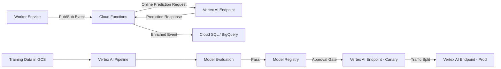

# Architecture Decision Records — NexusDeploy

This document captures the key architecture decisions made in NexusDeploy, the rationale behind them, and the trade-offs considered. It is structured in ADR (Architecture Decision Record) style.

---

## Table of Contents

1. [Network Topology](#1-network-topology)
2. [GKE Cluster Design](#2-gke-cluster-design)
3. [Service Mesh and Traffic Management](#3-service-mesh-and-traffic-management)
4. [Data Layer Architecture](#4-data-layer-architecture)
5. [Secret and Configuration Management](#5-secret-and-configuration-management)
6. [CI/CD Pipeline Design](#6-cicd-pipeline-design)
7. [High Availability Design](#7-high-availability-design)
8. [Disaster Recovery](#8-disaster-recovery)
9. [Blast Radius Analysis](#9-blast-radius-analysis)
10. [Progressive Rollout Strategy](#10-progressive-rollout-strategy)
11. [Observability Architecture](#11-observability-architecture)
12. [AI/ML Data Flow](#12-aiml-data-flow)

---

## 1. Network Topology

### Decision

Use a single custom-mode VPC per environment with dedicated subnets for GKE nodes, pods, and services using secondary IP ranges (alias IPs).

### Network CIDR Allocation

| Environment | Node Subnet | Pod Range | Service Range |
|-------------|------------|-----------|---------------|
| dev | 10.0.0.0/24 | 10.4.0.0/14 | 10.8.0.0/20 |
| staging | 10.1.0.0/24 | 10.12.0.0/14 | 10.16.0.0/20 |
| prod | 10.2.0.0/24 | 10.20.0.0/14 | 10.24.0.0/20 |

### Firewall Rule Hierarchy

```
Priority 1000  — allow-internal (TCP/UDP/ICMP between node, pod, service CIDRs)
Priority 1000  — allow-health-checks (GCP health check probe ranges)
Priority 1000  — allow-iap-ssh (35.235.240.0/20 → port 22, IAP tunnel only)
Priority 65534 — deny-all-ingress (0.0.0.0/0 → all protocols, default deny)
```

### Rationale

- Alias IP ranges eliminate the need for NAT between pods and allow direct VPC-native routing
- Cloud NAT provides outbound internet access for nodes without assigning external IPs
- IAP-based SSH eliminates bastion host attack surface; no port 22 open to the public internet
- Environment-level VPC isolation limits the blast radius of a compromised environment

---

## 2. GKE Cluster Design

### Decision

Private regional GKE cluster with separate node pools per workload class, workload identity enabled, and Shielded Nodes enforced.

### Node Pool Strategy

| Pool | Machine Type | Purpose | Autoscaling |
|------|-------------|---------|-------------|
| `system` | e2-medium | kube-system, monitoring agents | 1–3 per zone |
| `application` | e2-standard-4 | API gateway, auth service | 1–10 per zone |
| `worker` | e2-standard-8 | Background workers, batch jobs | 0–20 per zone |
| `spot` (dev/staging) | e2-standard-4 | Cost-optimized, preemptible | 0–20 per zone |

### Rationale

- Regional clusters spread across 3 zones eliminate single-zone failure as an incident cause
- Separate node pools allow workload-specific taints/tolerations for isolation and scheduling control
- Shielded Nodes provide measured boot, integrity monitoring, and vTPM attestation
- Workload Identity removes the need for service account key files on nodes

### Control Plane Access

The control plane is exposed only via a private endpoint. Access is controlled via authorized networks (CI/CD runner CIDRs, developer VPN ranges). No public endpoint is enabled in staging or production.

---

## 3. Service Mesh and Traffic Management

### Decision

Use GKE-native Ingress (Cloud Load Balancing) with `BackendConfig` for health checks and timeout tuning, rather than a service mesh like Istio, for simplicity at current scale.

### Rationale

- Istio adds significant operational overhead (control plane management, mTLS certificate rotation, envoy sidecar resource consumption)
- GCP-native ingress integrates directly with Cloud Armor, Identity-Aware Proxy, and Cloud CDN
- NetworkPolicy provides sufficient east-west security for current threat model
- This decision is revisited when mutual TLS between services becomes a compliance requirement

---

## 4. Data Layer Architecture

### Decision

Cloud SQL PostgreSQL with HA (regional) for transactional data; Memorystore Redis for caching and session state; Pub/Sub for async event queuing.

### Cloud SQL Configuration

- **HA mode**: Primary + standby replica in separate zones; automatic failover < 60s
- **Read replicas**: 1 read replica per environment for analytics queries (staging, prod)
- **Backups**: Automated daily backups with 7-day (dev), 30-day (staging), 365-day (prod) retention
- **Private IP only**: No public IP assigned; accessed via private services access from the VPC
- **Connection pooling**: PgBouncer sidecar in GKE deployments limits connection count to Cloud SQL

### Rationale

- Cloud SQL HA eliminates database as a single point of failure
- Private IP access removes Cloud SQL Proxy dependency and reduces latency
- Pub/Sub decouples producers from consumers; enables fan-out to multiple downstream processors including Vertex AI

---

## 5. Secret and Configuration Management

### Decision

All sensitive values (credentials, API keys, certificates) are stored in Cloud Secret Manager. Non-sensitive configuration is managed via Kubernetes ConfigMaps injected through Kustomize overlays.

### Secret Lifecycle

```
CI Pipeline creates/rotates secret → Secret Manager stores versioned value
→ Workload Identity grants GKE pod read access → Pod reads secret at startup
→ Rotation: new version created, old version disabled after 24h grace period
```

### Rationale

- Secret Manager provides audit logging for every access — who read what secret and when
- Version-based rotation allows zero-downtime secret rotation by updating the active version reference
- Never storing secrets in Kubernetes Secrets avoids the base64-encoding-as-security anti-pattern
- Separation of secret access by service account enforces least privilege at the secret level

---

## 6. CI/CD Pipeline Design

### Decision

Dual pipeline support: Jenkins (existing enterprise deployments) and GitLab CI (greenfield / cloud-native teams), with identical stage coverage and artifact outputs.

### Pipeline Stages

| Stage | Jenkins | GitLab CI | Output |
|-------|---------|-----------|--------|
| Lint & Validate | `sh terraform validate` | `terraform validate` job | Pass/fail |
| Unit Tests | `pytest` | `pytest` job | JUnit XML |
| Security Scan | Trivy + tfsec | Trivy + tfsec | SARIF report |
| Build Images | `docker buildx` | `kaniko` | Image digest |
| Push to Registry | `gcloud auth` + push | Built-in registry push | AR digest |
| Deploy Dev | `kubectl apply -k` | `kubectl` job | Rollout status |
| Integration Tests | `pytest -m integration` | Pytest job | JUnit XML |
| Deploy Staging | Helm upgrade | Helm upgrade job | Release status |
| Approval Gate | Jenkins input step | Manual trigger + env protection | Approval record |
| Deploy Prod | Helm upgrade (canary) | Helm upgrade job | Canary status |

### Rationale

- Identical stages ensure teams can switch pipelines without re-learning the delivery process
- Kaniko builds images inside containers without Docker daemon — safer in shared Kubernetes runners
- Approval gates are enforced at the pipeline layer, not just by convention

---

## 7. High Availability Design

### Failure Domain Mapping

| Component | Failure Domain | Recovery Mechanism | RTO | RPO |
|-----------|---------------|-------------------|-----|-----|
| GKE Node | Single node | Pod rescheduling | < 2 min | 0 |
| GKE Zone | Availability zone | Regional cluster redistribution | < 5 min | 0 |
| Cloud SQL | Zone | Automatic HA failover | < 60s | < 5s |
| Cloud Run | Instance | Platform-managed restart | < 10s | 0 |
| Cloud Functions | Instance | Platform-managed restart | < 5s | 0 |
| Memorystore | Zone (Basic) | Manual failover (Standard HA) | 1–5 min | Configurable |

### Pod Disruption Budgets

All production Deployments have a `PodDisruptionBudget` with `minAvailable: 50%` to survive node drain operations (cluster upgrades, node auto-repair) without dropping below half capacity.

### Anti-affinity Rules

Application pods use `podAntiAffinity` with `preferredDuringSchedulingIgnoredDuringExecution` to distribute replicas across zones and nodes, preventing co-location failures from taking out a majority of the service.

---

## 8. Disaster Recovery

### DR Strategy: Warm Standby (Regional)

NexusDeploy does not currently implement multi-region active-active (the cost is prohibitive for the reference architecture). Instead, it uses a warm standby approach:

- **Infrastructure**: Terraform state and module definitions allow a second region to be provisioned in < 30 minutes
- **Database**: Cloud SQL cross-region read replica can be promoted to primary in < 10 minutes
- **Container Images**: Artifact Registry multi-region repositories replicate images globally
- **Secrets**: Secret Manager is global; no replication step required
- **DNS**: Cloud DNS failover policies route traffic to the secondary region on health check failure

### DR Runbook

Full step-by-step DR procedures are in [RUNBOOK.md](RUNBOOK.md#disaster-recovery).

### Recovery Time Objectives

| Scenario | RTO | RPO |
|----------|-----|-----|
| Single service failure | < 5 min | 0 |
| Zone outage | < 10 min | 0 |
| Region outage | < 45 min | < 15 min (replication lag) |

---

## 9. Blast Radius Analysis

Understanding the maximum impact of any single failure or compromised component:

### Terraform Module Boundaries

Each Terraform module is independently deployable. A bug in the `monitoring` module cannot affect the `gke` or `vpc` modules because they share no state.

### Service Account Scope

| Service Account | Scope | Max Blast Radius if Compromised |
|----------------|-------|---------------------------------|
| `api-gateway-sa` | Read Cloud SQL, read Memorystore | Read access to application DB |
| `auth-service-sa` | Read Cloud SQL, read Secret Manager (auth secrets) | Auth secret exposure |
| `worker-service-sa` | Publish Pub/Sub, invoke Cloud Functions | Event injection |
| `ci-deploy-sa` | Push to Artifact Registry, deploy to GKE (non-prod) | Non-prod deployment |
| `ci-prod-deploy-sa` | Deploy to GKE (prod only) | Prod deployment |

### Network Blast Radius

VPC Service Controls perimeter limits data exfiltration. Even with full GKE node compromise, the attacker cannot exfiltrate data from Cloud SQL or Cloud Storage outside the perimeter.

---

## 10. Progressive Rollout Strategy

### Application Deployments

```
Canary (5%) → Observe 15 min → Staged (20%) → Observe 30 min → Full (100%)
```

Implemented via Helm `values.yaml` with `canary.weight` + a Kubernetes Service with traffic splitting annotations.

**Automatic rollback triggers**:
- Error rate > 1% for 5 consecutive minutes during canary
- p99 latency > 2× baseline for 10 consecutive minutes
- Error budget burn rate > 2× steady-state

### Infrastructure Changes

Terraform plan is applied with `-target` scoping for high-risk changes to limit the surface area of a single apply. Database schema migrations run in a separate job before the application rollout begins, with a compatibility window ensuring the old app version can run against the new schema.

### Model Deployments (Vertex AI)

```
Shadow mode (0% traffic, log predictions) → Canary (5%) → Staged (20%) → Full (100%)
```

Shadow mode allows the new model to process real traffic in parallel without affecting users, enabling offline comparison before any traffic is shifted.

---

## 11. Observability Architecture

### Three Pillars

| Pillar | Tooling | Retention |
|--------|---------|-----------|
| Metrics | Cloud Monitoring (custom metrics via OpenTelemetry) | 6 weeks (metrics), 30 months (aggregated) |
| Logs | Cloud Logging → GCS sink for long-term storage | 30 days hot, 1 year cold (GCS) |
| Traces | Cloud Trace (OpenTelemetry SDK, auto-instrumented) | 30 days |

### SLO Implementation

SLOs are defined as Cloud Monitoring `ServiceLevelObjective` resources, provisioned by the `terraform/modules/monitoring/` module. Alert policies fire on **burn rate** — how fast the error budget is being consumed — rather than on raw error rates, which reduces alert fatigue during low-traffic periods.

### Structured Logging

All services emit JSON-structured logs with fields: `severity`, `message`, `trace_id`, `span_id`, `service`, `environment`, `version`. This enables correlation across services via the `trace_id` field in Cloud Logging.

---

## 12. AI/ML Data Flow



### Feature Store Usage

Features used in training are served from Vertex AI Feature Store at inference time. This eliminates training-serving skew — the single most common cause of model performance degradation in production.

### Latency Budget

The async inference path via Cloud Functions adds a P99 latency of < 200ms to event processing, well within the Worker Service SLO. Synchronous inference is not used in the hot path to avoid cascading failures if the Vertex AI endpoint is temporarily degraded.
